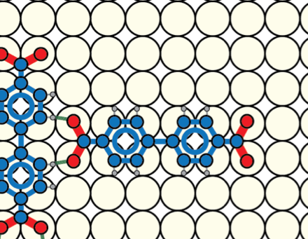
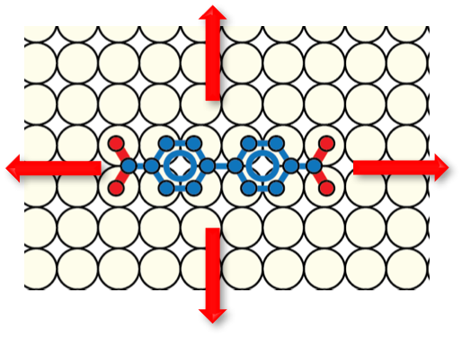
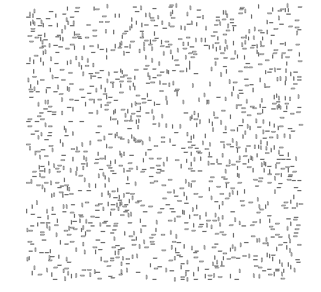
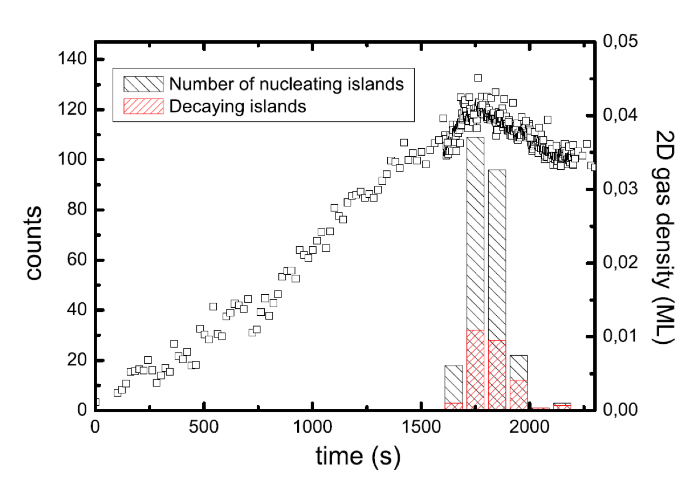
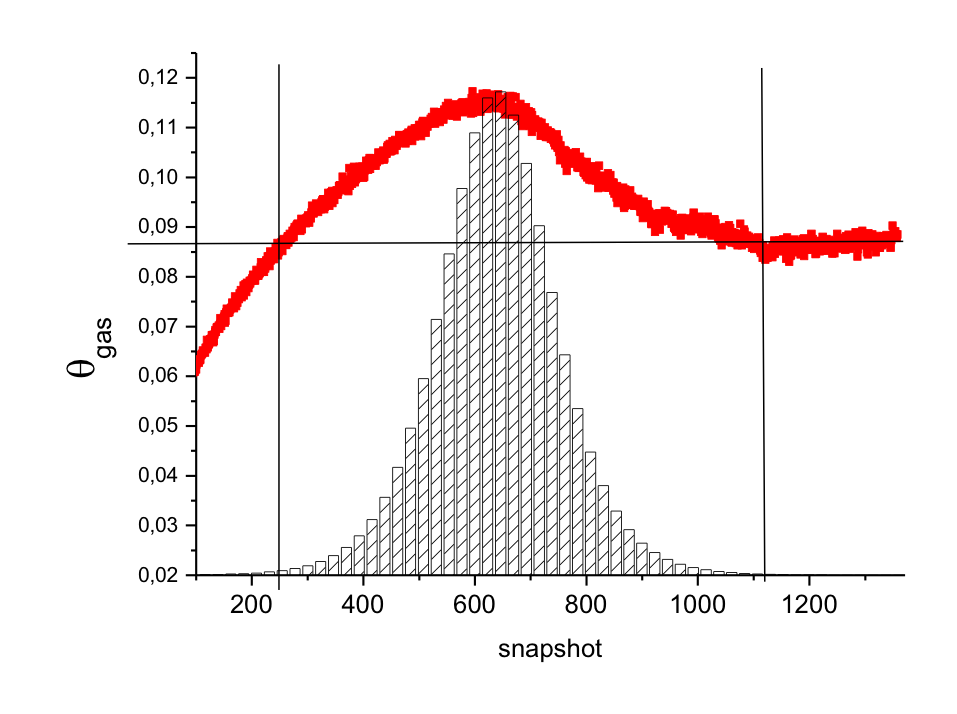

#Description

##Motivation

Simple KMC simulation to learn more about the 2D crystallization dynamics of small organic molecules. 
Motivation was to further understand the nucleation dynamics of 4,4-biphenyldicarboxylic acid (BDA) on Cu(001), which shows several interesting phenomena, including surprisingly large unstable nuclei forming (References).
The goal was to check if a simple set of rules, namely fixed orientation and only short term interaction (== hydrogen bonds) can reproduce the findings.

##Implementation
From experiments it is established that BDA forms a rectangular lattice where the carboxylic acid group interacts with the phenyl rings of the next (perpendicular) molecule, interpreted as two hydrogen bonds. We simulate this interaction by assigning each hydrogen bond a value of ε. 

| |  |
|---- | ----|

We further restrict the movement of each molecule along one of four high symmetry directions of the underlying (square) Cu(001) crystal lattice and don't allow rotations of molecules.

###Program steps
In short, the code does the following steps:

1. Pick one molecule at random, choose one of four moves:
left, right, up, down by one Cu lattice site
2. Calculate energy before and after move:
	* 	Free molecule: E = 0
	* 	Per hydrogen bond: E=ε (negative)
3. If move reduces total E: accept
Otherwise: accept with p=exp(-ΔE), or go to next Monte Carlo step.
4. "semi-kinetic" part: Count number of accepted steps, after 	(N_unbound * F) steps put new molecule at random position. N_unbound is the number of molecules not bound (less than 2 hydrogen bonds). If the position is already occupied cancel deposition and go to next Monte Carlo step.

The molecules are treated as two distinct species, one for each possible rotation. 
The horizontally aligned molecules are simplified to:

|   | **-2** | **-1** | **0**  | **1** | **2** | **3** |
|  ------ | ------ | ------ | ------ | ------ | ------ | ------ |
|  **1** | 1 | 2 | 3 | 3 | 2 | 1 |
|  **0** | 1 | 2 | 3 | 3 | 2 | 1 |

and the vertically aligned molecules:
			
|   | **-1** | **0** |
|  ------ | ------ | ------ |
|  **-2** | 4 | 4 |
|  **-1** | 2 | 2 |
|  **0** | 5 | 5 |
|  **1** | 5 | 5 |
|  **2** | 2 | 2 |
|  **3** | 4 | 4 |

where 1 (horizontal) and 4 (vertical) roughly corerspond to the position of oxygen atoms (carboxylic acid groups) and 3 (horizontal) and 5 (vertical) to the location of C-H. Experiments found that the molecules preferably form bonds between the 5-1 and 3-4 positions. In a next step this interaction is captured in a 5x5 interaction array Earray, where the only non-zero entries are for Earray(5,1), Earray(1,5), Earray(4,3) and Earray(3,4). The interaction term is set to ε for these combinations.
Finally a 32x32 array is populated with all possible (relevant) relative positions of two molecules and the total interaction term for each is calculated. By adjusting the position list and interaction array the simulation can be generalized to other systems. 

#Some results

Both starting at the same coverage (0.01 molecules per lattice site) and deposition rate (one new molecule every after each unbound molecule had the chance to perform 2000 diffusion steps), but with different interaction strength (ε=-1.4 vs ε=-1.7):

| |  |
|---- | ----|
|ε=-1.4 | ε=-1.7 |

| |  |
|---- | ----|
|ε=-1.4 | ε=-1.7 |

